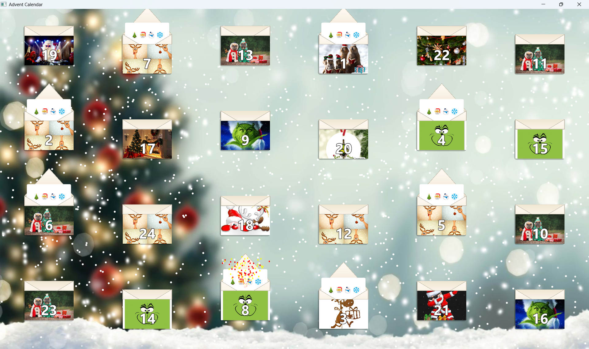
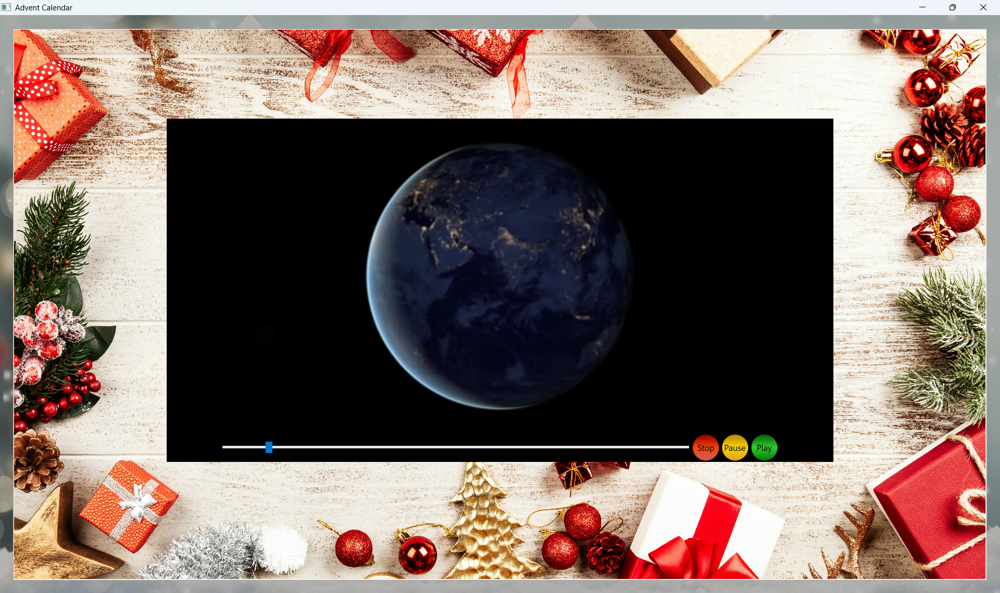

## Advent Calendar App

This app is a simple Advent Calendar that shows text, image and video surprises.

Click on the letter corresponding to the current or past days (only in december), and the surprise will be displayed.

Here are some screenshot of the app.

Video surprise:

Text surprise:

### Customize The Calendar

You can customize some aspects of the calendar, such as the images on the letters, background music and, of course, the surprises. Here's how.

###### App directory structure:

├──AdventCalendar  
│  
├── bin  
│  
└── data  

The data folder contains the app status file (status.dat), which stores information about the letters' state: whether they are open or closed. You can delete this file in order to reset app status. The data folder also contains customizable content, which is not encrypted in this version.

data folder has  the following structure:

letters/  
music/  
1/  
2/  
3/  
...

- letters/ contains image files that will be displayed on the app's letters. Image files can have any name. Images will be displayed randomly on the letters.

- music/ contains music files that will be played by the app, choosen randomly. Music files can have any name. 

- number folders(1-24): correspond to the surprise folders, each representing a day of the calendar. If a folder for a specific day does not exist, no surprise will be shown for that day. Number folders can contain:
  
  - A `.txt` file, for a text-only surprise
  
  - An image or video, with an optional `.txt` file.

The app will load the data from these folders automatically.
